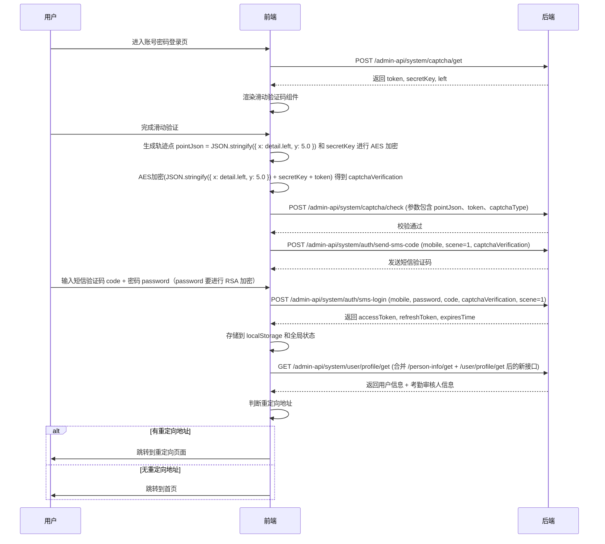

# 考勤系统移动端登录模块文档

## 文档信息

| 项目     | 内容           |
| -------- | -------------- |
| 名称     | 考勤系统移动端 |
| 版本号   | v2.0.0         |
| 涉及模块 | 登录模块       |
| 更新日期 | 2026-03-31     |

## 修订记录

| 版本 | 日期       | 修订内容     | 作者 |
| ---- | ---------- | ------------ | ---- |
| v1.0 | 2026-03-31 | 创建登录模块 | 罗钧 |

## 一、目标

- 支持“工作助手”APP 统一登录认证，实现单点登录
- 提供账号密码验证码登录 + 天翼认证登录的双因子登录方式
- 引入滑动图形验证码，提升安全性
- 减少登录过程中的网络请求次数，优化加载速度

## 二、功能范围

本次修改仅涵盖**登录模块**，包括登录页、注册页（注册流程与登录共用验证码逻辑）。后续模块（首页、考勤打卡、审批等）不在本文档范围内。

## 三、用户角色

| 角色     | 说明                                           |
| -------- | ---------------------------------------------- |
| 普通员工 | 需要登录系统进行考勤打卡、申请等操作           |
| 考勤审核员   | 需要登录系统进行考勤打卡、申请、执行审批等操作 |

## 四、功能详述

### 4.1 登录/注册页

#### 4.1.1 入口判断逻辑

系统启动时，首先判断当前运行环境是否为“工作助手”APP：

- **是** → 直接调用 APP 统一登录认证接口，静默登录，无需用户输入账号密码。
- **否** → 展示登录方式选择页，提供两种登录方式：
  - 账号密码 + 短信验证码登录
  - 天翼认证登录（调用天翼 SDK）

> 注：本文档仅详细描述**账号密码 + 短信验证码登录**流程。天翼认证登录另见技术对接文档。

#### 4.1.2 账号密码 + 短信验证码登录流程

#### 4.1.3 关键交互说明

| 步骤 | 动作 | 说明 |
| --- | --- | --- |
| 1 | 获取图形验证码 | 页面挂载时调用 `/admin-api/system/captcha/get`，返回字段包括：`token`、`secretKey`、`left`（缺口距离左侧位置，用于前端定位滑块）。 |
| 2 | 渲染滑动验证码 | 前端根据 `left` 值初始化滑块组件，用户拖动滑块完成拼图。 |
| 3 | 滑动验证校验 | 用户滑动结束后，前端获取滑动轨迹点 `detail.left`，构造 `pointJson = JSON.stringify({ x: detail.left, y: 5.0 })`。使用 `secretKey` 对 `pointJson` 进行 AES 加密，得到加密后的 `pointJson`。调用 `/admin-api/system/captcha/check` 接口，传入 `pointJson` 和之前返回的 `token` 进行校验。 |
| 4 | 获取短信验证码 | 滑动验证通过后，再次使用相同的 `pointJson` + `secretKey` + `token` 进行 AES 加密（与上一步算法相同），得到 `captchaVerification`。调用 `/admin-api/system/auth/send-sms-code`，参数：`mobile`（手机号）、`scene:1`（登录场景）、`captchaVerification`。 |
| 5 | 登录请求 | 用户输入短信验证码和密码后，调用 `/admin-api/system/auth/sms-login`，参数：`mobile`、`password`（新增字段）、`code`（短信验证码）、`captchaVerification`、`scene:1`。 |
| 6 | 存储凭证 | 登录成功返回 `accessToken`、`refreshToken`、`expiresTime`，前端需存储到 localStorage 和全局状态（如 Vuex / Redux）。 |
| 7 | 获取用户信息 | **接口合并**：原 `/admin-api/system/user/profile/get` 和 `/admin-api/system/person-info/get` 合并为一个新接口（建议命名为 `/admin-api/system/user/profile`）。一次返回用户基本信息 + 考勤审核人信息。 |
| 8 | 跳转逻辑 | 登录前若有重定向地址（如从某未登录页面跳转过来），则登录成功后跳回该地址；否则跳转至首页。 |

> 后端需确保 `/admin-api/system/user/profile` 接口返回用户基本信息及考勤审核人信息，不再单独请求 `/person-info/get`。

## 五、异常处理

| 场景                   | 提示文案                 | 处理方式                       |
| ---------------------- | ------------------------ | ------------------------------ |
| 获取图形验证码失败     | “网络异常，请稍后重试”   | 提供重试按钮                   |
| 滑动验证失败           | “请完成滑块验证”         | 重置验证码组件                 |
| 短信验证码发送失败     | “验证码发送失败，请重试” | 允许用户重新获取（60秒倒计时） |
| 登录接口返回密码错误   | “账号或密码错误”         | 清空密码框                     |
| 登录接口返回验证码错误 | “验证码错误，请重新获取” | 清空验证码输入框，重新获取短信 |
| token 过期             | “登录已过期，请重新登录” | 清除本地存储，跳转登录页       |

---

**文档状态**：待评审  
**评审日期**：待定
